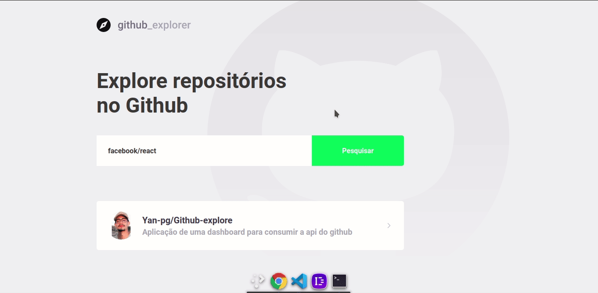

  

<h3 align="center">Github Explorer</h3>

---

 Few lines describing your project.
     

## 📝 Table of Contents

- [About](#about)
- [Getting Started](#getting_started)

## 🧠About 

 </a>

Application of a panel to consume the github api, and on the root page has a search input and returns me the list of all repositories that have already been searched and that is saved in LocalStorage, being able to get more information by clicking on the preferred repository

## 🏁 Getting Started 

<pre># Clone this repository
$ git clone https://github.com/Yan-pg/Github-explore.git 
 

# Go into the repository
$ cdGithub-explore

# Install dependencies
$ yarn install

# Run the app
$ yarn start</pre>

## ⛏️ Built Using 

- [Api](https://api.github.com/) - Api GitHub
- [ReactJS](https://pt-br.reactjs.org/) - Web Framework

Made with <g-emoji class="g-emoji" alias="purple_heart" fallback-src="https://github.githubassets.com/images/icons/emoji/unicode/1f49c.png"></g-emoji> by Yan César <g-emoji class="g-emoji" alias="wave" fallback-src="https://github.githubassets.com/images/icons/emoji/unicode/1f44b.png"></g-emoji>